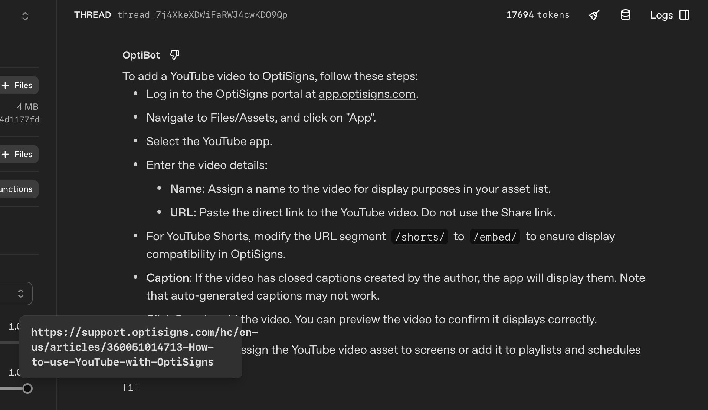

# helpcenter-sync-bot

Scrapes the OptiSigns public Help Center (Zendesk API), converts articles to
Markdown, and loads them into an OpenAI Assistant's Vector Store via the API,
with a daily delta-only update job.

## Setup

```bash
cp .env.sample .env   # fill in OPENAI_API_KEY, OPENAI_ASSISTANT_ID, OPENAI_VECTOR_STORE_ID
pip install -r requirements.txt
```

**One-time manual step:** Create the Assistant in the OpenAI Playground,
paste the system prompt from `docs/system_prompt.txt` verbatim into
Instructions, enable File Search, create an empty Vector Store named
`optibot-docs`, attach it to the Assistant, and copy both IDs into `.env`.

## Run locally

```bash
python main.py
```

Or via Docker:

```bash
docker build -t helpcenter-sync-bot .
docker run --env-file .env helpcenter-sync-bot
```

Expected final log line:
`Run complete: added=X updated=Y skipped=Z total_live_articles=402 | vector_store files: completed=N ...`

## Delta detection (stateless, idempotent)

Each article's Zendesk `updated_at` is compared against the value last stored
for that article. New id → upload; newer `updated_at` → upload the new file,
then remove the old vector-store file and delete the old file object (no stale
duplicates); unchanged → skip.

Crucially, the "value last stored" is **reconstructed from the vector store
itself on every run**, not from a local file. Each uploaded file carries
`{article_id, updated_at, url}` as OpenAI file *attributes*; a run lists them to
rebuild prior state. This keeps the job idempotent even on the deployed
**ephemeral** container, where a local `state.json` would be wiped between runs
and cause the whole corpus to be re-uploaded daily. `data/state.json` is still
written, but only as a derived debug artifact — the vector store is the source
of truth. Reconstruction also reconciles any duplicate copies down to one per
article, so the job self-heals a polluted store. See
[`docs/stateless-delta-design.md`](docs/stateless-delta-design.md) for the full
rationale.

Running the job twice with no upstream change produces
`added=0 updated=0 skipped=402` — and so does running it once after deleting
`state.json`, which simulates the ephemeral container. Acceptance test:
`python eval/verify_stateless.py`; one-time migration for pre-attribute files:
`python eval/backfill_attributes.py`.

## Chunking strategy

`max_chunk_size_tokens=800`, `chunk_overlap_tokens=400` (static chunking).
Help Center articles are short and single-topic with step-by-step
instructions; 800 tokens keeps a full instructional step intact rather than
splitting mid-procedure. 400-token overlap prevents context loss at chunk
boundaries.

This choice was **validated empirically**, not picked arbitrarily. The
harness in `eval/` spins up a throwaway vector store per strategy, runs a
ground-truth Q&A set, and scores retrieval (reading the chunks file_search
actually retrieved) and answer quality. Across `static_800_400`, `auto`, and
a structure-aware section-split strategy, retrieval-hit was 100% and deep-fact
coverage was identical — i.e. for articles this short, chunk sizing is not the
bottleneck. We keep the explicit static setting (per spec) since it ties the
best and is fully controllable. Run it with `python eval/chunking_eval.py`.

## Daily job

Deployed as a **DigitalOcean App Platform Scheduled Job** built from this
Docker image:

- App: `opti-bot` · Component: `hc-sync-bot` (kind: `SCHEDULED`)
- Schedule: `0 6 * * *` (06:00 UTC daily)
- Region: SGP1

The container runs `python main.py` once and exits 0; the daily cadence is the
platform's job, not an internal loop. Each run logs the summary line, e.g.:

```
Run complete: added=0 updated=0 skipped=402 total_live_articles=402 | vector_store files: completed=402 in_progress=0 failed=0 total=402
```

Logs: DigitalOcean dashboard → app `opti-bot` → **Activity → Jobs** → select a
run → **Runtime Logs**. A captured run log is in `docs/do_logs.png`.

## Citations

The system prompt asks the bot to cite `Article URL:` sources. The Assistant's
`file_search` tool surfaces citations through its own annotation system rather
than echoing literal text, so to make those citations resolve to the real
article URL we set **each uploaded file's filename to the article URL itself**
(see `vector_store_client.upload_markdown_file`). In the Playground the answer
then cites the source article and the citation resolves to the correct
`support.optisigns.com` URL. The article URL is also written into the document
body for traceability.

## Playground sanity check

After upload, ask the Assistant **"How do I add a YouTube video?"** in the
Playground and confirm the answer is grounded in the docs and cites the source
article URL.



## Design notes

The reasoning behind the load-bearing choices (and the process / evidence behind
them) is recorded for the review conversation:

- [`docs/engineering-journey.md`](docs/engineering-journey.md) — **start here**:
  the full story — symptoms, experiments, evidence, and lessons, including the
  dead ends and the production incident.
- [`docs/decisions.md`](docs/decisions.md) — decision log: data source,
  chunking, model, citations, delta detection, deployment.
- [`docs/stateless-delta-design.md`](docs/stateless-delta-design.md) — why delta
  state is reconstructed from the vector store, and the idempotency argument.
- [`docs/lessons-learned.md`](docs/lessons-learned.md) — reusable engineering
  lessons for future projects.
